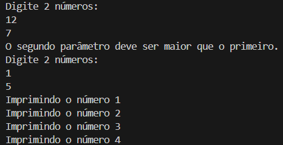

# Desafio DIO - Conta Bancária

Projeto proposto pelo Bootcamp Bradesco - Java Cloud Native da DIO, que tem o objetivo de criar um contador de acordo com os dados fornecidos pelo usuário.

A classe possui as seguintes funcionalidades:
- Solicita a entrada de 2 números inteiros através da classe **Scanner**;
- Verifica se o segundo número de entrada é maior que o primeiro. Se não for, uma exceção ocorre e são solicitados novos números;
- Utiliza os dados fornecidos para calcular a quantidade de números que será impressa;
- Imprime os números na quantidade calculada a partir do 1.

## Exemplos de funcionamento:

